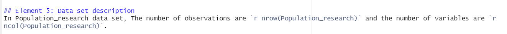

```{r setup, include=FALSE}
knitr::opts_chunk$set(echo = TRUE, warning = FALSE, message = FALSE, fig.align = "center",fig.path = "Image/ ")
```

## Element 1: R code chunk for loading libraries
The main R packages in this report are *tidyverse*,*knitr* and *maps*.
```{r library, echo=FALSE, warning= FALSE, message= FALSE}
library(tidyverse)
library(knitr)
library(maps)
```

## Element 2: Overall introduction
On the cusp of global epidemic and economic slump, we have intuitively felt the burden of population aging on society. According to a startling demographic forecast from the [United Nations](https://www.un.org/en/global-issues/ageing), aging problem  has evolved into a global concern: by 2050, one in six persons in the world (or 16%) will be over the age of 65 and a substantial ramp up from  703 million to 1.5 billion since 2019. Such change may restructure nowadays social welfare Systems and  economic productivity.
 
 Hence, Understanding the **attributes and  rules of prospective aging population change** becomes more and more imperative. 

## Element 3: Research question
The research is targeted for G20 country members, which represent the worldwide largest economies with 80% GWP contributed.
The topic we mainly focused on is :
1. what  is the mean of median age in geographical distribution from 2012 to 2021 ?

2. what is the tendency of life expectancy among  different median age countries?
*Remark: Europe union is not considered in the data set, but add permanent member Spain in*

## Element 4: Data set introduction
### Part I Data wrangling
The [life_expectancy](https://ourworldindata.org/life-expectancy) is a data set from our world data website to measure entity's life expectancy per  year from 1950-2021. [median_age](https://ourworldindata.org/age-structure) is a data set from Our World Data website to measure   entity's median age per year starting from 1950 and end with prediction to 2100.
The Population_research is a tidy data that combines necessary variables combined from median_age and life_expectancy，with the records of G20 members from 2012 to 2021 only.

Here is the following processing code for Population_research：
```{r  data_tidy}
#data reading
life_expectacy<-read.csv("Data/life-expectancy.csv",header = TRUE)
median_age<- read.csv("Data/median-age.csv", header = TRUE)

# create the list of G20 countries
G20<-c("Australia","United States","Canada","Saudi Arabia","India","China","Russia","Germany", "Mexico","Brazil","Argentina","Italy", "France", "United Kingdom","Turkey", "South Africa","Japan","South Korea","Indonesia","Spain")

# Data tidy and narrow for median age and life_expectancy
median_age_tidy<-median_age %>% 
  filter(Year<= 2021 & Year>=2012,Entity %in% G20) %>% 
  rename(median_age= "Median.age...Sex..all...Age..all...Variant..estimates") %>% mutate(Entity=(str_remove_all(Entity, " \\(UN\\)")), matcher=paste0(Entity,Code,Year))

life_expectacy_tidy<-life_expectacy  %>%
  filter(Year<= 2021 & Year>=2012,Entity %in% G20) %>% 
  rename(life_expectacy = "Life.expectancy.at.birth..historical.") %>% mutate(matcher=paste0(Entity,Code,Year)) %>% 
  select(life_expectacy:matcher)

# combine median age and life expectancy
Population_research <- left_join(median_age_tidy, life_expectacy_tidy, by="matcher") %>% select(Entity, Year, median_age, life_expectacy) 

#save CSV
write.csv(Population_research,file="Data/Population_research.csv")
```

### Part II Variable  description
In Table \@ref(tab:Table1), it shows the summary of Variable name (*"Entity”,"Year","life_expectancy" and "median_age"*)   and the corresponding explanation that were collected for G20 countries from 2012 to 2021. 
```{r kable_name}
#data frame creation
Kable_names<-data.frame(Variable_name=names(Population_research), Explaination=c("The country name in G20 members","the year of research conducted","an index that can segement entire population equally ","a statistical measure of the average time of a person longevity per country "))
```

```{r Table1}
Kable_names %>% kable(booktabs= TRUE, caption = "The list of Variable names in Population_research")
```


## Element 5: Data set description
In Population_research data set, The number of observations are `r nrow(Population_research)` and the number of variables are `r ncol(Population_research)`.
```{r Picture1, fig.cap="Screenshot"}

```
Figure \@ref(fig:Picture1) depicts use incline code nrow to measure the total number of observations/rows and ncol to measure the total number of variables/columns.

To observe type of variables, use head function below:
```{r head}
head(Population_research,2)
```
In this data frame: The Entity is character variable, Year（integer), median_ age and life expectancy(double） are numeric variables.

## Element 6: Results section


```{r plotQ1, fig.cap="The median age distribution for G20 country"}
#Set up map  boundary
World_map<- map_data("world") %>% arrange(region)

#Measure the median age mean by Entity and data tidy
Population_research_1 <- aggregate(median_age~ Entity, FUN  = mean,data= Population_research) %>% 
  rename(region= Entity) %>% 
  mutate(region= recode(region, "United Kingdom"="UK","United States"="USA"))

#File combination for map boundary and Population research
Graphic_1<- left_join(World_map, Population_research_1, by="region")

#Geom_map plot
ggplot(Graphic_1, aes( x= long, y= lat, map_id = region))+
geom_map(aes(fill = median_age), map=World_map , color="black") +
  scale_fill_gradient(low = "green", high = "red", na.value = "gray")  +
  theme_void() +
  theme( legend.position="bottom")
```
In the Figure \@ref(fig: plotQ1), we observe that:

*1.Countries with high median populations（Color red pattern) are mainly concentrated in Western Europe and East Asia, whereas Latin America, South& South East Asia and Africa have relatively young populations(Color green pattern).*
*2. Countries that are classified as high-income and well-developed in G20 are more vulnerable to the aging problem than less-developed countries.*

```{r plotQ2,fig.cap="The life expectancy between 2012 and 2021"}
# filter Top 3 and bottom 3 countries in median age
Top_Bottom_countries <-c("Japan","Germany","Italy","South Africa","India","Mexico")

# Geom_line plot the relationship between year and life_expectancy, filter by country
Population_research %>% 
  filter(Entity %in% Top_Bottom_countries) %>% 
  ggplot(aes(x= Year, y= life_expectacy, group= Entity, color= Entity)) +geom_line(size=1.5)+
  geom_point(color= "Black")+
  theme_light()+
  guides(color = guide_legend(title = "Country",reverse = TRUE))+
  annotate("text",x= 2021, y=c(84.3,82.4,80.1,70.8,66.5,61.8), label=c(84.8,82.9,80.6,70.2,67.2,62.3),size=3,color="gray31")
```
In the Figure \@ref(fig: plotQ2), we  select the top three highest and lowest countries for comparison and observe that:
*1. In most of the sample countries, the life expectancy display a marginal creep up from 2012 to 2019. Nevertheless, except Japan from 2019， life expectancy in all countries has declined to varying degrees, and countries with  high median  age have suffered for a greater slump.*
*2. Countries with higher median ages tend to maintain higher life expectancy，vice reverse.*


## Appendix

